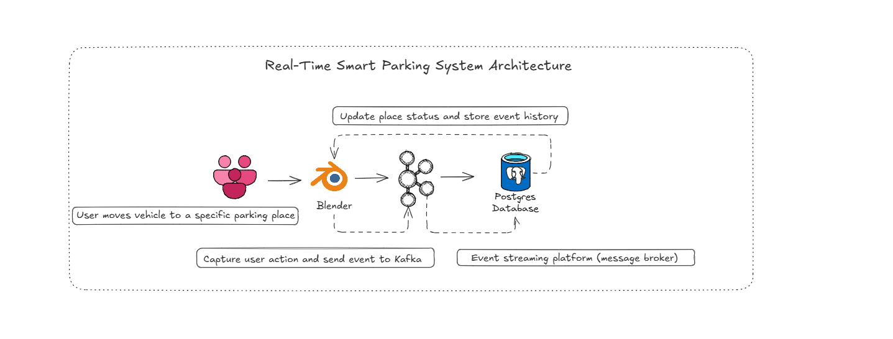
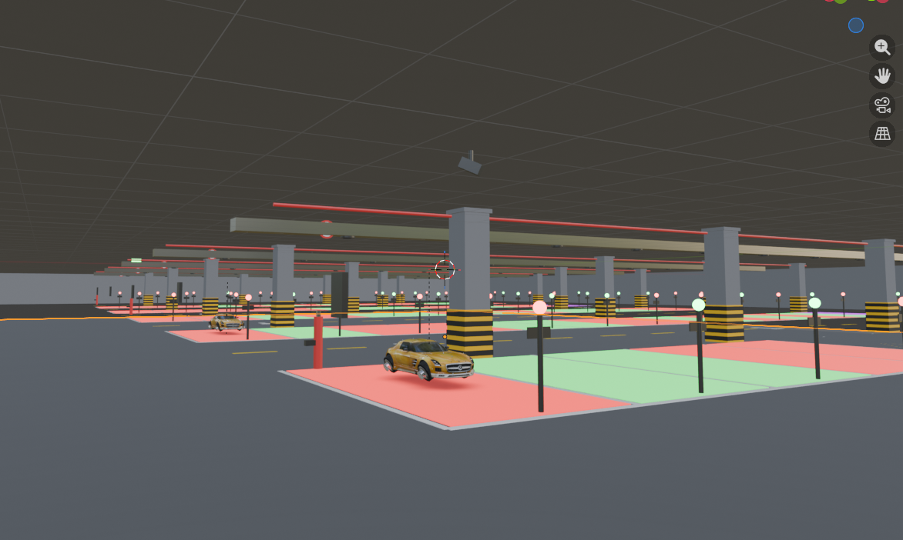
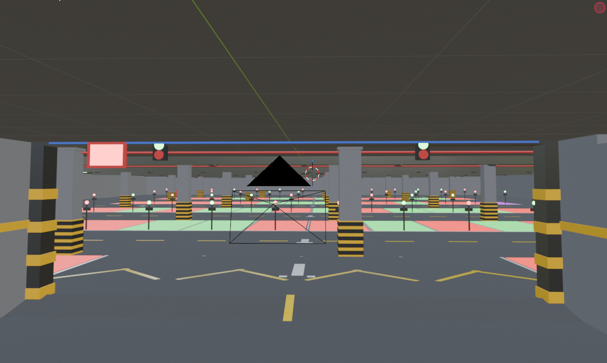
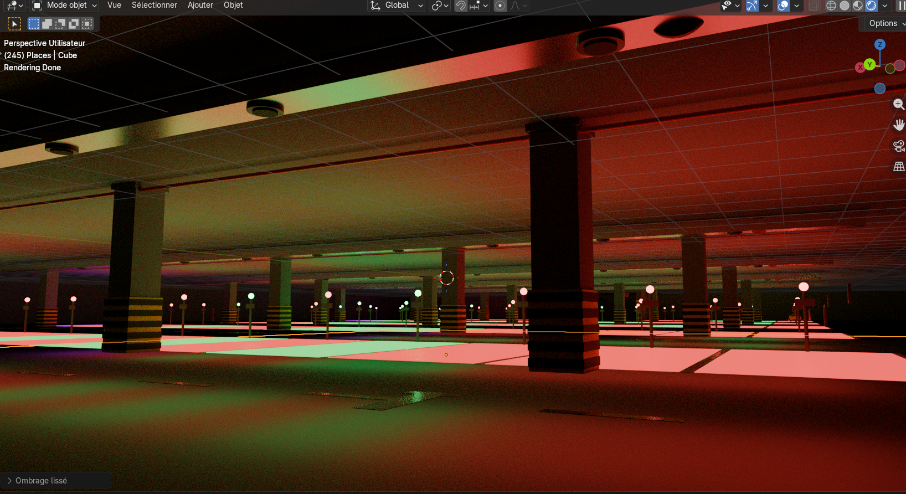
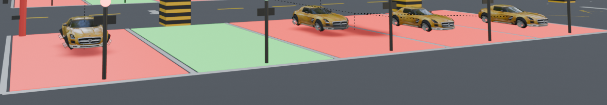
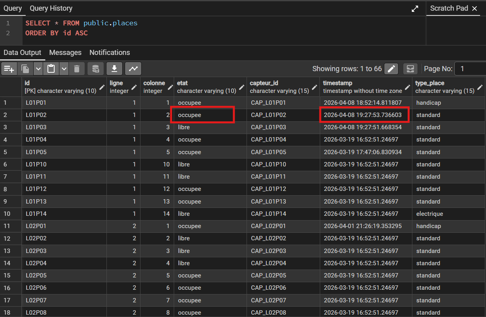
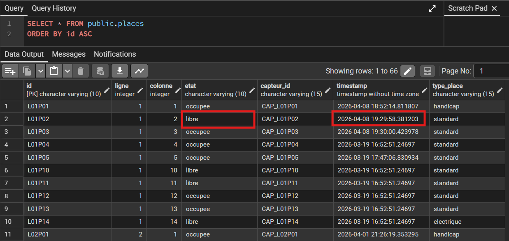

#  Smart Parking 3D — Real-Time Data Pipeline

A smart parking simulation combining **3D visualization (Blender)**, **event streaming (Kafka)**, and **data persistence (PostgreSQL)**.

---

##  Overview

This project demonstrates a real-time intelligent parking system:

- 3D underground parking modeled in Blender  
- Move a car to a specific place (row/column)  
- Automatic color update (🟢 free / 🔴 occupied)  
- Kafka event streaming  
- PostgreSQL synchronization  
- Historical tracking of parking states  

---

##  Architecture


---

## Scene and execution overview

###  Blender Scene (Global View)




---

###  Realistic Render


---

###  Before Movement (Place Free)


---

###  After Movement (Place Occupied)


---

###  PostgreSQL — Before Update


---

###  PostgreSQL — After Update


---

##  Features

- Real-time parking state update  
- Event-driven architecture using Kafka  
- PostgreSQL synchronization  
- Historical data tracking for future ML prediction  
- Procedural 3D scene generation using Blender (bpy)  

---

##  Technologies

- Blender (Python API — bpy)  
- Apache Kafka  
- PostgreSQL  
- Docker / Docker Compose  
- Python (psycopg2, kafka-python)  

---

## How to Run

### 1. Start infrastructure
```bash
docker compose up -d
```

### 2. Run Kafka Consumer
```bash
python kafka/consumer_parking.py
```
### 3. Open Blender

Open blender/parking_scene.blend
Run the Python script inside Blender


###  Services
```

Kafka → localhost:9092
```
```bash
PostgreSQL → localhost:5432
```
```bash
pgAdmin → http://localhost:5050
```
```bash
Kafka UI → http://localhost:8080
```
### Data Model
places: current state of each parking spot
historique: event history for analytics
###  Key Concept
This project is not just a 3D simulation — it is a complete real-time data pipeline:
Blender = Presentation layer
Kafka = Streaming layer
PostgreSQL = Storage laye
